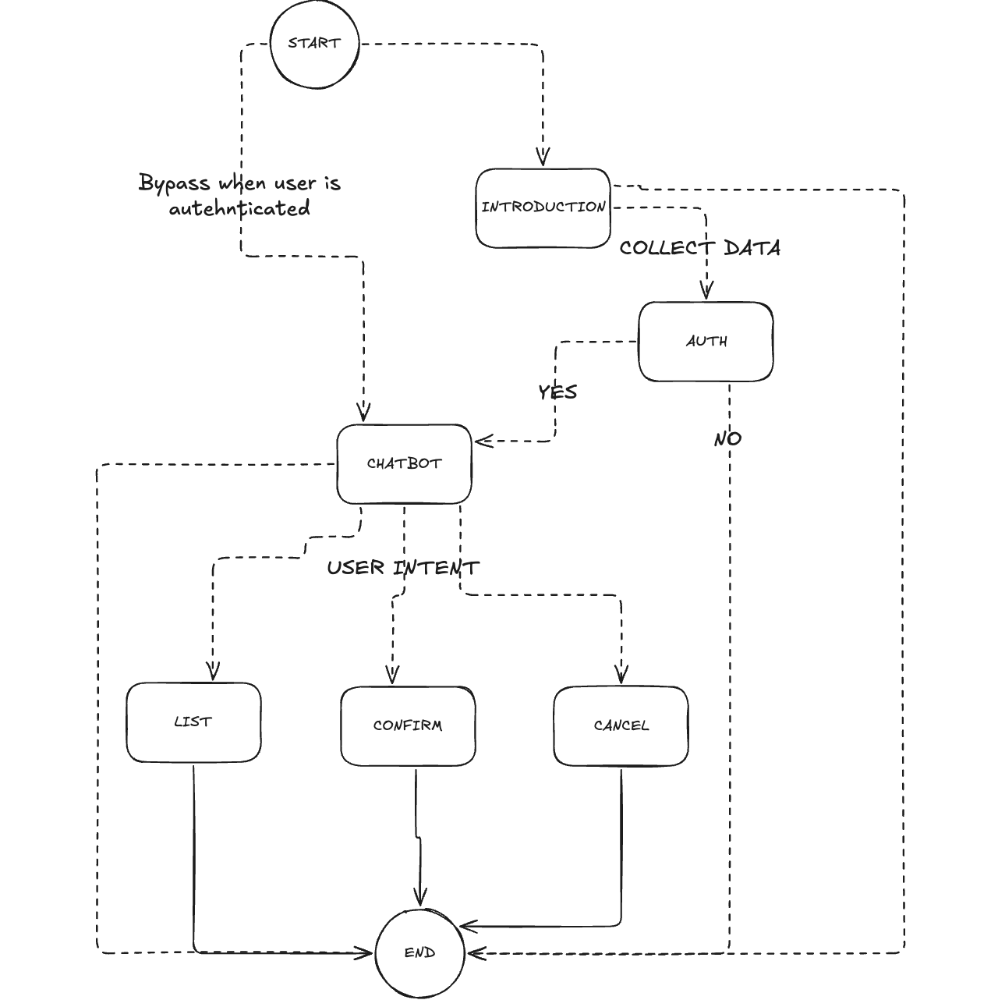

# PoC - Healthcare Appointment Chatbot

A modern healthcare appointment management system powered by **LangGraph** and **FastAPI**, featuring conversational AI that helps patients manage their appointments through natural language interactions.

## ✨ Features

- 🔐 **User Verification**: Secure patient identity verification
- 📋 **List Appointments**: View scheduled appointments  
- ✅ **Confirm Appointments**: Confirm existing appointments
- ❌ **Cancel Appointments**: Cancel unwanted appointments
- 🔄 **Free Navigation**: Move between actions naturally in conversation
- 💾 **Session Persistence**: Maintains conversation state

## 🏗️ Architecture

- **Backend**: FastAPI + LangGraph + SQLite
- **Frontend**: Vanilla HTML/CSS/JavaScript
- **AI Model**: Claude Sonnet via Anthropic API
- **Graph Framework**: LangGraph for conversation flow
- **State Management**: InMemorySaver for session persistence

## 🚀 Quick Start

### Prerequisites

- [uv package manager](https://github.com/astral-sh/uv)
- Python 3.11+
- Anthropic API key

### Installation

1. **Install dependencies**:
   ```bash
   uv sync
   ```

2. **Set up environment**:
   ```bash
   # Create .env file
   echo "ANTHROPIC_API_KEY=your_api_key_here" > .env
   echo "DEFAULT_MODEL=claude-3-7-sonnet-latest" >> .env
   ```

3. **Run the server**:
   ```bash
   uv run uvicorn app.api:app --reload
   ```

4. **Open your browser**:
   Navigate to http://localhost:8000

## 🧪 Testing

### Test sample data:

> **Why In-Memory SQLite with Sample Data?**
> For this PoC, we use an **in-memory SQLite database** (`:memory:`) that gets initialized with sample data on each startup. This approach provides:
> - **Zero setup**: No database installation or configuration needed
> - **Consistent testing**: Fresh data on every run ensures reproducible demos
> - **Fast iteration**: Changes to sample data are immediate
> - **Isolation**: Each session is completely independent
>
> The sample data is created in `app/database.py` and includes realistic healthcare scenarios for testing all chatbot features.

#### Available Test Patients:
| Patient | Phone | Date of Birth | Authentication Info |
|---------|-------|---------------|---------------------|
| **John Smith** | 555-010-1001 | 1985-03-15 | Use these exact values to authenticate |
| **Maria Garcia** | 555-010-2001 | 1990-07-22 | Use these exact values to authenticate |

#### Pre-loaded Appointments:

**For John Smith (Patient ID: 1)**
| Type | Doctor | Date | Time | Status | Notes |
|------|--------|------|------|--------|-------|
| General Checkup | Dr. Anderson | Tomorrow | 09:00 | scheduled | Can be confirmed or cancelled |
| Blood Test | Dr. Brown | In 3 days | 14:30 | scheduled | Can be confirmed or cancelled |

**For Maria Garcia (Patient ID: 2)**
| Type | Doctor | Date | Time | Status | Notes |
|------|--------|------|------|--------|-------|
| Follow-up | Dr. Wilson | In 2 days | 10:15 | scheduled | Can be confirmed or cancelled |

> **Note**: Dates are dynamically generated relative to the current date (tomorrow, in 2 days, etc.) to ensure appointments are always in the future during testing.

### 🎯 Example Usage

1. **Verification**:
   ```
   User: "Hi, I'm John Smith, 555-010-1001, 1985-03-15"
   Bot: "Hello John! Your identity has been verified. How can I help?"
   ```

2. **List Appointments**:
   ```
   User: "What are my appointments?"
   Bot: "Here are your appointments: General Checkup with Dr. Anderson..."
   ```

3. **Cancel Appointment**:
   ```
   User: "Cancel my appointment with Dr. Brown"
   Bot: "Your Blood Test appointment has been successfully cancelled."
   ```

## 📁 Project Structure

```
chatbot-test/
├── graph/                 # LangGraph workflow logic
│   ├── models.py          # Pydantic models & ChatbotState
│   ├── nodes.py           # All node functions
│   ├── routing.py         # Routing logic + auth bypass
│   └── builder.py         # Graph construction
├── app/                   # Application & database logic
│   ├── database.py        # SQLite setup & sample data
│   ├── tools.py           # LangChain tools
│   └── api.py             # FastAPI endpoints
├── main.py                # CLI entry point
├── index.html             # Frontend interface
├── pyproject.toml         # Dependencies (UV)
└── .env                   # Configuration
```

## 🔄 Conversation Flow

1. **Introduction** → Collects user data (name, phone, DOB)
2. **Authentication** → Verifies against database  
3. **Chatbot** → Detects user intent
4. **Actions** → List/Confirm/Cancel appointments
5. **Re-routing** → Continue conversation naturally

### 📊 Visual Workflow



## 🛠️ API Endpoints

### POST `/chat`
Main conversation endpoint.

**Request**:
```json
{
  "message": "I am John Smith, 555-010-1001, 1985-03-15",
  "thread_id": "optional-thread-id"
}
```

**Response**:
```json
{
  "message": "Hello John! Your identity has been verified...",
  "thread_id": "generated-or-provided-id",
  "authenticated": true
}
```

### GET `/health`
Health check endpoint.

### GET `/`
Serves the frontend HTML interface.
